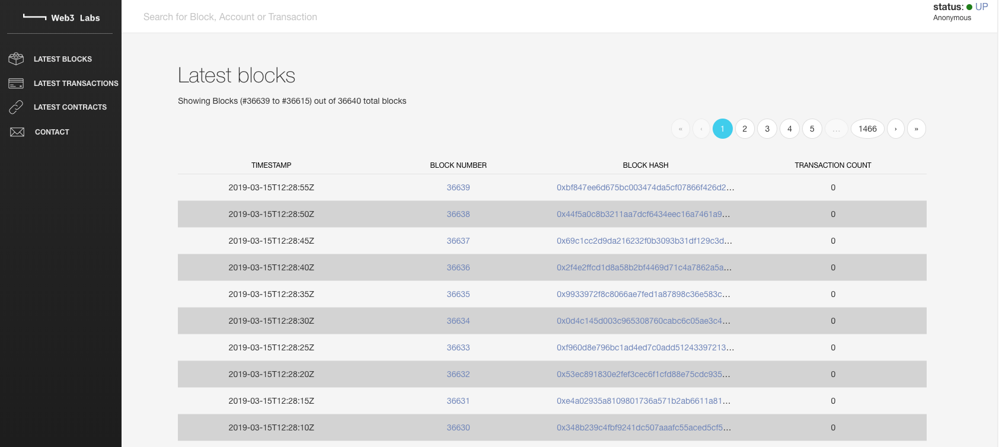
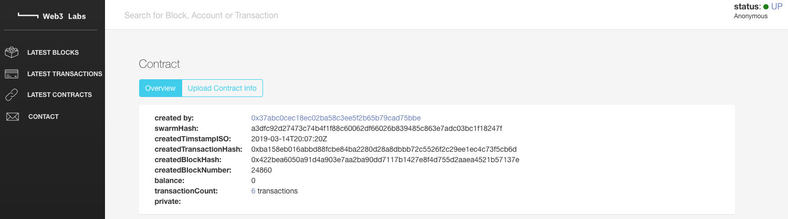
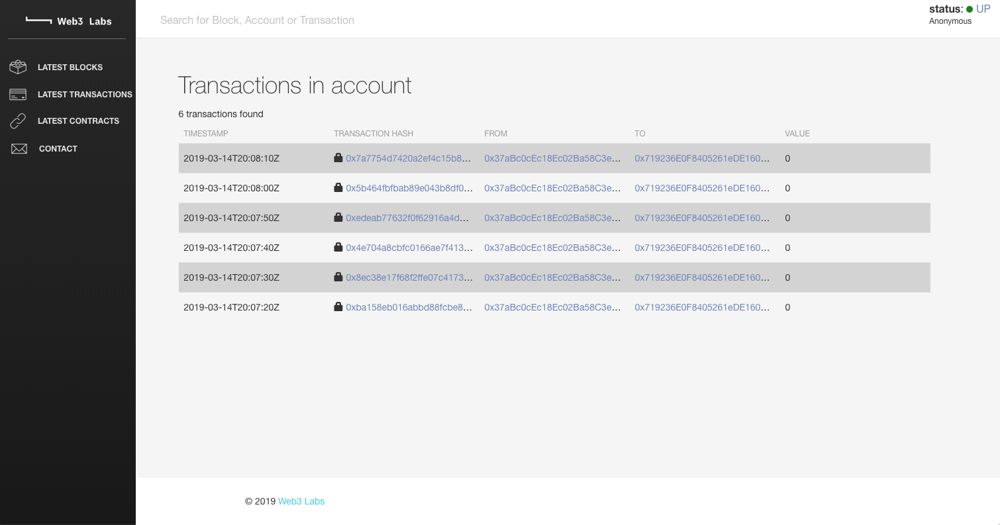
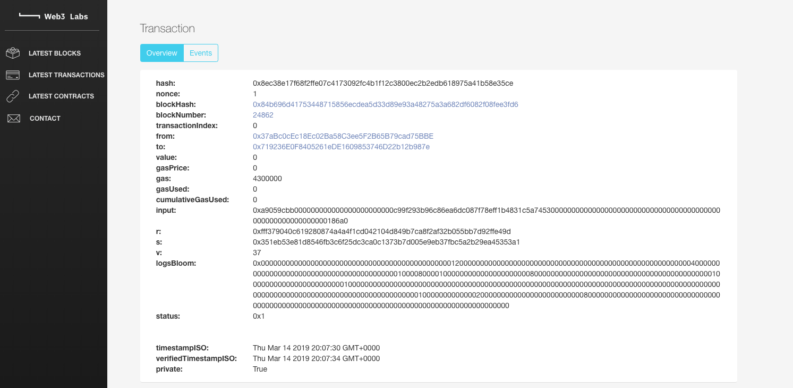

# Quorum Token Java Sample

This project demonstrates the creation and management of a private token on a Quorum network.
 
Quorum privacy is used, only certain members of the network are privy to the 
token that has been created.

It is written in Java using [web3j](https://web3j.io) which is maintained by 
[Web3 Labs](https://www.web3labs.com).


## Prerequisites

A Quorum network running with at least 4 transaction nodes.

You will need the following details for each node:
- Node URL, `http://<node-url>:<node-port>`
- Transaction enclave address, `<base64 encoded public key>`

## Running the application

You will need to update the 
[TokenApplication](src/main/java/com/web3labs/quorum/token/TokenApplication.java#L33) 
class with details of the URL for each of your transaction nodes and their associated public keys.

```java
// FIXME: Add node URL and transaction node keys here
Node nodeA = createAndUnlockAccount("nodeA", "http://<node-url>", "<transaction node key>");
Node nodeB = createAndUnlockAccount("nodeB", "http://<node-url>", "<transaction node key>");
Node nodeC = createAndUnlockAccount("nodeC", "http://<node-url>", "<transaction node key>");
Node nodeZ = createAndUnlockAccount("nodeZ", "http://<node-url>", "<transaction node key>");
```

Where your node url would be similar to `https://<app>.<yourdomain>.com:3200/{}` and 
the nodekey would be a base64 encoded public key such as 
`V4pb2lVRMwLZXGGmm/Ee3Y2U7BTlQ+BO8abrktMbSSQ=`.

Then to run the application, simply type:

```bash
./gradlew run
```

The application logs the different activities it completes, which are as follows:

1. Create an Ethereum account on nodes A, B, C and D.
1. Deploy a Quorum Token (symbol QT) contract that is visible only to nodes A, B and C, but not D.
1. Transfer QT to accounts associated with nodes A, B, C, D.
1. Display all account balances.
1. Demonstrate that node D cannot see the QT assigned to its account.
1. Increase the supply of QT.
1. Display all account balances.
1. Decrease the supply of QT.
1. Display all account balances.

There are also a couple of 
[integration tests](src/test/java/com/web3labs/quorum/token/TokenApplicationIT.java) 
you can use to test the application.

## Viewing contracts and transactions

The Web3 Labs blockchain explorer provides an easy to use UI for browsing transaction 
and contract details.

```bash
git clone https://github.com/blk-io/blk-explorer-free.git
cd blk-explorer-free
NODE_ENDPOINT=http://<node-url> docker-compose up
```

You may access the blockchain explorer via http://localhost:5000.



You can then browse the smart contract that was created by obtaining the token contract address, 
which is logged as follows:

```bash
19:53:10.853 [main] INFO  c.w.quorum.token.TokenApplication - Quorum Token (QT) created at contract address 0x<contract-address>, by account 0x<creation-account>
```

You can view the contract itself via the url `http://localhost:5000/contract/0x<contract-address>`:



You can also view the private transactions:



And details of those transactions:



If you wish to learn more about our Epirus contract registry and blockchain explorer, 
including our production-ready SaaS offerings which include features such as authentication 
and BI integrations please [contact us](mailto:hi@web3labs.com).
